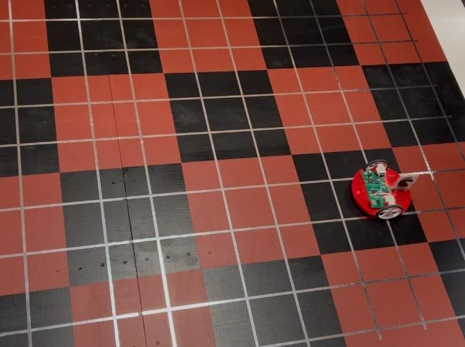

# KnightBot FPGA – SystemVerilog Chess Robot (Fall 2024)

This repository contains the SystemVerilog implementation of **KnightBot**, an FPGA-controlled robot that simulates the movements of a knight piece on a chessboard. The project was developed for a digital design lab course, under the direction of the instructor, who provided the full system specification and behavioral requirements.

---

  

## 🧠 Project Overview

**KnightBot** is a robot built around a Finite State Machine (FSM) and I/O control modules, implemented on an FPGA using SystemVerilog and synthesized using Synopsys tools. The robot is capable of:

- **Calibrating** itself to a checkered grid using onboard IR sensors  
- **Executing knight (L-shaped) moves** to a user-specified target square  
- Performing a complete **Knight’s Tour**, visiting every square of the board exactly once  
- **Playing the SpongeBob SquarePants theme** on a buzzer after each valid move

---

## ⚙️ Core Features

- ✅ **Calibrate Mode** – Aligns the robot to a known origin square using edge detection via IR sensors  
- ♞ **Knight Movement Engine** – Accepts user input and calculates valid L-shaped knight moves  
- 🧭 **Knight’s Tour Mode** – Visits all squares without repetition (Hamiltonian path logic)  
- 🔊 **Audio Feedback** – Plays a melody on successful moves using a PWM-driven buzzer  
- 🧱 **Edge Detection** – Prevents invalid moves using IR sensors to detect board boundaries  
- 🧪 **Modular Design** – Built using clean, testable FSM and datapath components in SystemVerilog  

---

## 🔧 Hardware Synthesis

The design was synthesized using **Synopsys Design Compiler**, and timing was analyzed with static timing analysis tools. To meet critical timing constraints:

- The **PID controller** used for motor control was **pipelined** to improve performance and close timing.
- Additional logic optimizations and FSM restructuring were performed based on synthesis reports.

This stage ensured that the SystemVerilog design met both functional and performance requirements for hardware implementation.

---

## 🖥️ Technologies Used

- FPGA development board 
- SystemVerilog HDL  
- Synopsys Design Compiler & STA  
- ModelSim / Quartus for simulation and synthesis  
- IR sensors and PWM buzzer for real-world interaction  
- FSM and pipelined datapath design patterns  

---

## 🎓 Course Info

This project was completed as part of a Fall 2024 digital design course [ECE 551]. All specifications and behavioral expectations were provided by the instructor [Eric Hoffman], and the implementation was carried out entirely in **SystemVerilog** by the student team.

---

## 📝 Acknowledgments

Special thanks to the course instructor for the creative and engaging project specification and guidance throughout the semester and to my team mates who also worked on the project.

---
